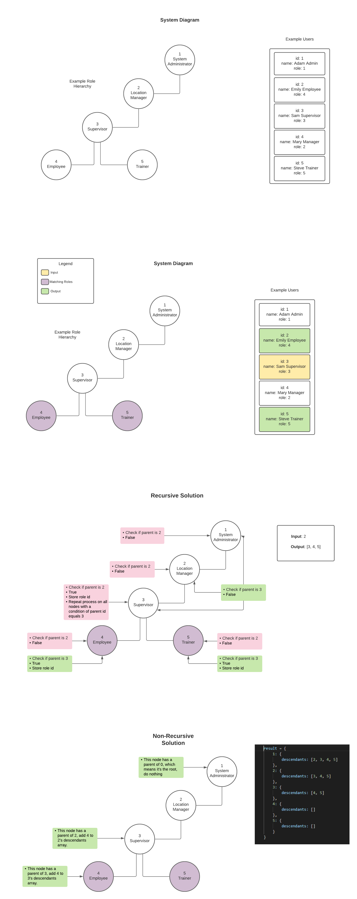

# deputy-coding-challenge
This repository contains my code for the Deputy coding challenge.

## How To Run
This project requires Node.js v17.3.0 or greater to run.

Clone this repository.

Execute `$ npm install` at the command line to install required packages.

    - Jest for the testing suite.
    - readline-sync for interactive CLI input

To run the test suite execute

`$ npm run test`

To run as a console app with test data execute: 

`$ npm start`

## Diagrams

